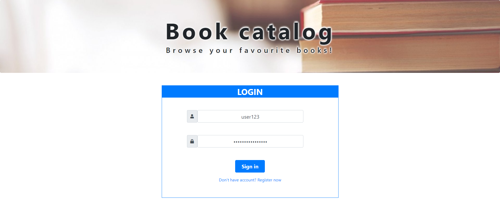
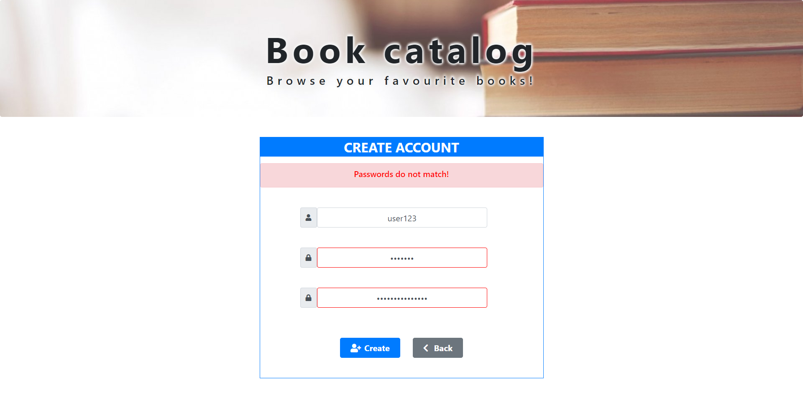
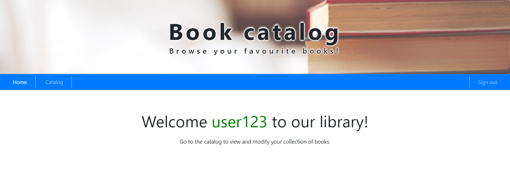
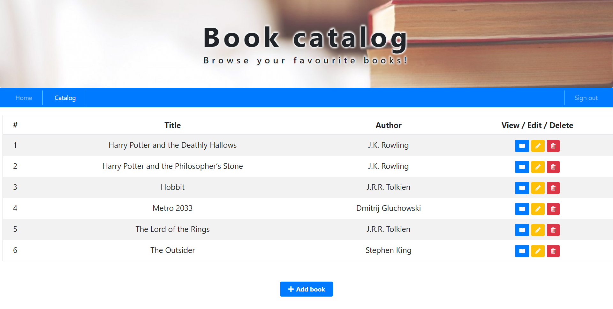
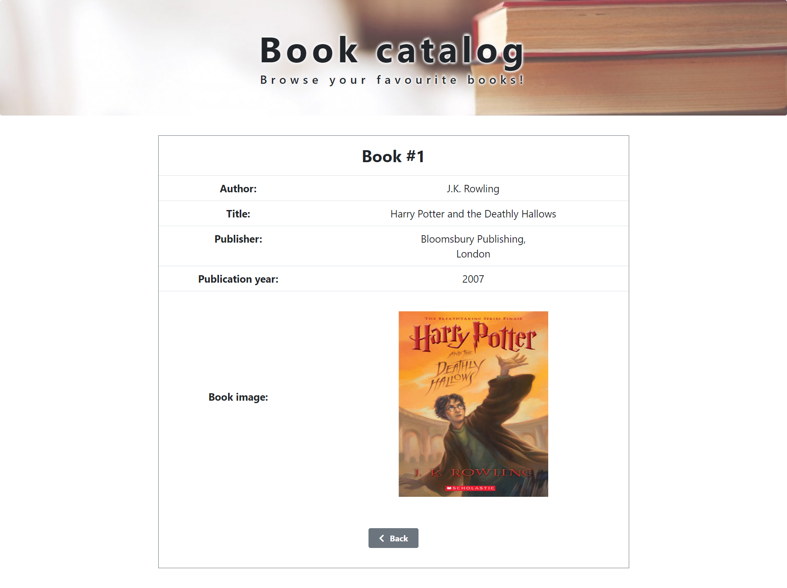
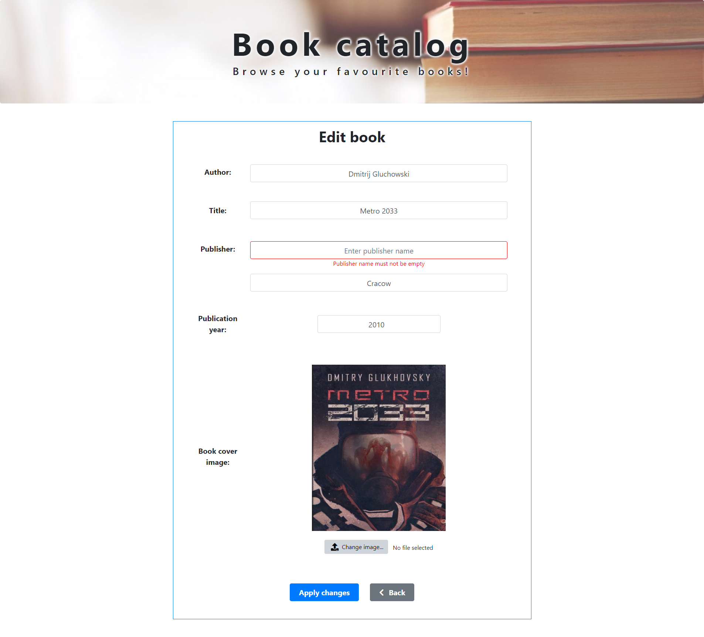
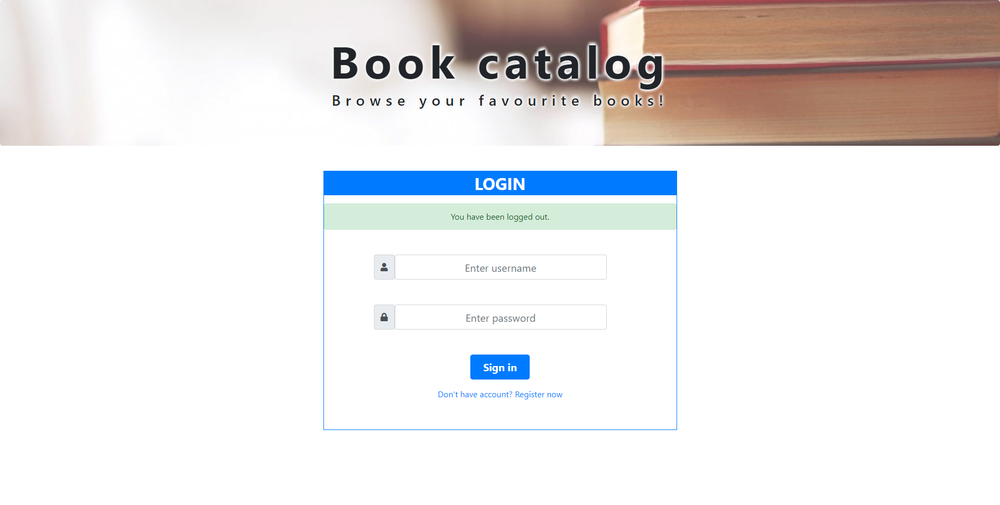

# book-catalog
Web application for book collection management.

Application presentation: https://youtu.be/1SKyccI9UPs

## Table of contents
* [Features](#features)
* [Screenshots](#screenshots)
* [Technologies](#technologies)
* [Author](#author)

## Features
* login and user registration 
* create a new book (contains:
    - an author,
    - title, 
    - publisher, 
    - publication year,
    - book cover image)
* view collection of books from Database
* view details of selected book
* edit selected book
* delete chosen book
* validate if:
    - input fields are not empty
    - book / user already exist in Database
    - username, password are correct

## Screenshots
   
   
   
   
   
   
   
 

## Technologies
* Java - v11
* Spring Boot - v2.3.2
* Spring Data JPA
* Spring Security
* Spring MVC
* H2 Database - v1.4.200
* Thymeleaf
* Maven - v3.6.3
* JUnit - v5.6.2
* Mockito - v3.3.3
* HTML
* CSS
* Bootstrap - v4.5.2

## Author
Adrian Bloch

